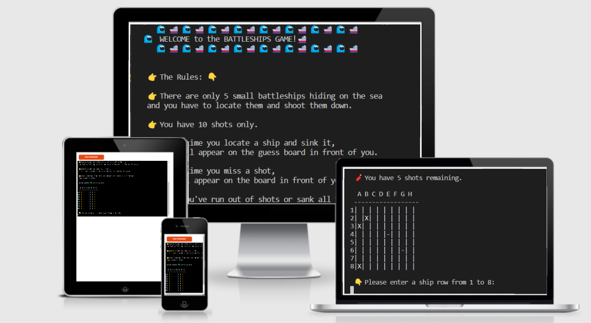

# BATTLESHIPS GAME

Welcome to the Battleships, a fun online game for everyone who likes guessing!

Would you like to have fun and play a guessing game? Learn how to read coordinates and have fun guessing the location of small battleships. Can you locate all five battleships before you run out of shots? Let’s find out!

-----

## Showcase

A deployed link to the application can be found [here](https://battleship-game-by-ps.herokuapp.com/) and the Github repository link can be found [here.](https://github.com/psnaz/battleships-game)

-----

## User Experience (UX)

----

## Strategy

### Project Goals

The target audience (end users) of this project are players of all ages, predominantly children between 7-10 who like guessing games and would like to learn coordinates. 

The end user is looking for a fun way to be entertained while playing a guessing game and also learning to state coordinates.

The benefit of this project is fun and learning at the same time.

### User Stories

- Site User goals:
    - As an end user I want to have some fun and learn to tell coordinates at the same time.
    - As an end user I want to get excited about the chance 
    - As an end user I want to receive clear instructions to be able to understand what this game is about, how to play it and be notified if I won or lost.
    - As an end user I want to be able to read and understand the instructions easily.

- Site Owner goals:
    - I want to provide entertaining learning platform to teach how to tell coordinates and practice
    - I want to give users clear instructions

-----

## Design

### Skeleton

This game consist of one page which is the terminal page. The terminal page is not responsive hence no wireframes added, but the following flowchart was created using [diagrams.net](https://www.diagrams.net/):

-----

## FEATURES

### Current Features

This simple online application is based on the traditional strategy board game Battleships played by two players. Battleships is a single player online application that teaches the user to state coordinates while playing a fun guessing game. The computer generates 5 single field battleships that are concealed on the board hidden from the player. On the screen the player can see a guessing board that records his guesses - hits or misses. 

### The Welcome Banner and Rules
The first thing the player sees when the application loads is a welcome banner and underneath are explained the Rules. The welcome banner and rules will display at the beginning of the game only.

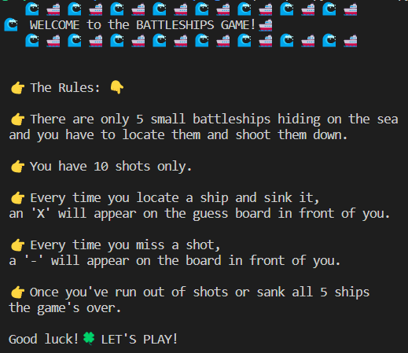

### Guessing Board
Below the rules is displayed a guessing board (size 8 x 8) that records the guesses (hits and misses) the player takes. It shows two types of coordinates: Horizontal coordinates are letters from A to H. Vertical coordinates are numbers from 1 to 8. This board will get updated every time the player will take a guess. The hits are displayed as an X and the misses are displayed as a hyphen (-).

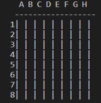

#### Asking for Coordinates (User’s Input)

The player is asked to enter a number between 1 and 8 first.

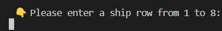

Then the player is asked to enter a letter between A and H.

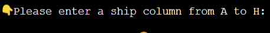

If the player states a number or a letter outside the scope or accidentally presses enter key, he will be notified of his error and asked to provide the required input again.

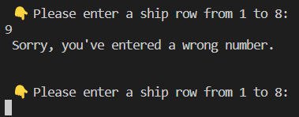

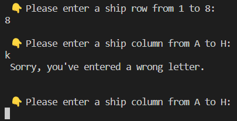

#### Displaying Guesses and Shots Left

Player’s guesses are recorded on the guessing board while the player is always provided with relevant feedback for their action - whether they hit a ship or missed one.

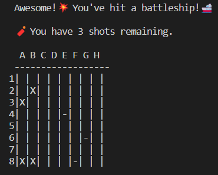

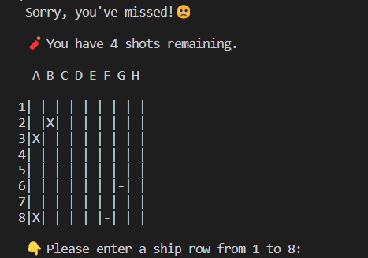

They are also notified if they’ve accidentally guessed a coordinate they’ve used already.

After every  guess they’re also notified how many shots they have left.

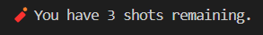

#### The End of Game

How does the game end? 
The player wins the game if he shoots down all five ships before he runs out of shots.

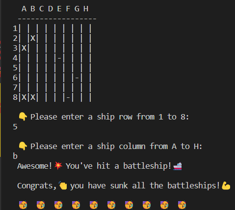

Or 

The player loses the game if he runs out of his 10 shots before he sinks all five ships.
The player is shown where all the ships were hidden. 

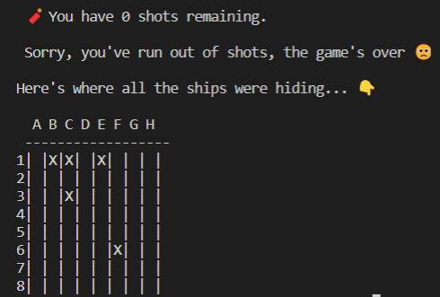

-----

## Technologies Used

### Languages Used

- Python

### Frameworks, Libraries and Programs Used

- Git: Git was used for version control by utilizing the Gitpod terminal - to commit to Git and push to GitHub
- GitHub: Github is used to store the project's code after being pushed from Git.
- Heroku: Heroku used to deploy the online application
- Emojis module imported: emoji==1.7.0
- [diagrams.net](https://www.diagrams.net/) used to create the flowchart

-----

## Credits

### Code

#### If not marked otherwise in run.py file, the majority of the code came from:

- [’How to code Battleship in Python - Single Player Game’ tutorial](https://www.youtube.com/watch?v=tF1WRCrd_HQ) by Knowledge Mavens.

- CI Love Sandwiches Walkthrough project 

#### Otherwise based on the Diploma in Software Development study materials and my notes taken while going through the materials.

#### Other materials studied:

1. 5 Video tutorials by Dr Codie:
Part 1
- [Python Coding Example]( https://youtu.be/Ej7I8BPw7Gk) 
- [Python Coding Example | 1]( https://youtu.be/EziS2eGZGz4)
Part 2
- [Python Coding Example Random | II](https://youtu.be/r9yXpel08AA)
Part 3
- [Python Coding Example | III | End Game | I](https://youtu.be/RqyR-naxh60)
- [Python Coding Example | III | End Game | II](https://youtu.be/aMLSS-JVYZk) 
Final Game
[Python Coding Example Video](https://youtu.be/GmWHhAGvaQA) 

2. [The Modern Python 3 Bootcamp by by Colt Steele](https://www.udemy.com/course/the-modern-python3-bootcamp)

3. [How to Use the Emoji Module in Python by O.T. Chidalu](https://www.educative.io/answers/how-to-use-the-emoji-module-in-python)

4. [Unicode Emoji List](https://unicode.org/emoji/charts/emoji-list.html)

5. [PEP 8 – Style Guide for Python Code](https://peps.python.org/pep-0008/)

6. [Stackoverflow](https://stackoverflow.com/) - used as the main troubleshooting go to resource

-----

## Content

All content was written by the developer.

### Acknowledgements

I would like to say a BIG thank you to :
- [Shellie Downnie](https://www.linkedin.com/in/shelliedownie-softwaredeveloper/) – CI student I meant on a webinar and via LinkedIn. and her fun game project ‘Don't Step in the Poop’ that made me aware of being able to use colours and emojis in Python  
- Tutor support at Code Institute for all their help and support.
- Code Institute Slack Community for all their advice and support.
- My husband and our boys for having tonnes of patience with me being on the computer hours no end
- My mentor Guido Cecilio Bernal for his patience, kindness and great advice and support 

-----

## Testing

### User Stories Testing

I have tested all the above described features of this app manually by carrying out the following tests:

- Step 1: adding various incorrect and multiple characters into both of the user input fields (enter a ship row from 1 to 8/ enter a ship column from A to H). The only time the application breaks is when CTRL + C and CTRL + D are used which is a standard way to stop running a python script. As this a part of the terminal functionality this is not to be fixed. I have double-checked this with the tutoring service.

- Step 2: testing the correct display of ‘hit’/ ‘ miss’ / ‘you have X shots left’ features was carried out at the same time as step 1 while the ‘hidden board’ (where the coordinates of the battleships were created) was temporarily displayed as a part of a testing mode to facilitate and speed up the guessing process. All options were displayed correctly in the relevant situations and reaching the relevant step in the game.

To sum up, when tested manually on my desktop and a mobile phone (Samsung A6) all the functionalities and features were working properly as described in the Features Section above.
The

As all our family devices are Microsoft or Android based, I had not the opportunity to test the app on Safari web browser, I have only tested on Chrome, Microsoft Edge and Mozilla Firefox. When tested on Mozilla Firefox, unfortunately, the emojis don’t display properly - only the left half of each emoji image is always displayed - see the picture below, but all the functionalities work properly. 

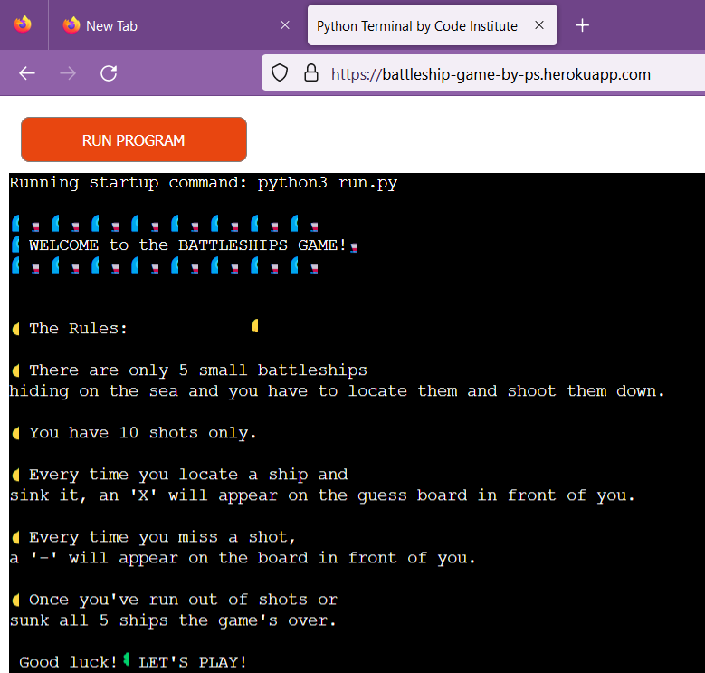

### Validation

Originally, the [PEP8](http://pep8online.com/) was used to validate the project code to ensure that there were no syntax errors in the project. However, by the time I finished amending and testing this project, the service was no longer available and I had to use a different Python validation service - Pythonchecker.com. No syntax errors have been detected.

- [Pythonchecker](https://www.pythonchecker.com/) - See results below

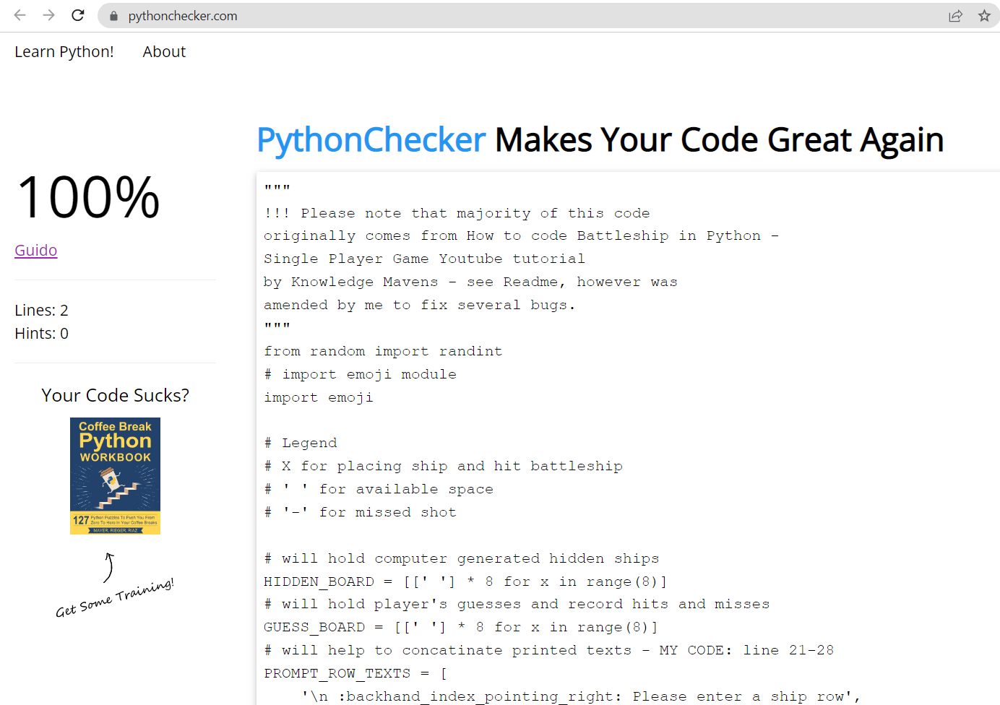

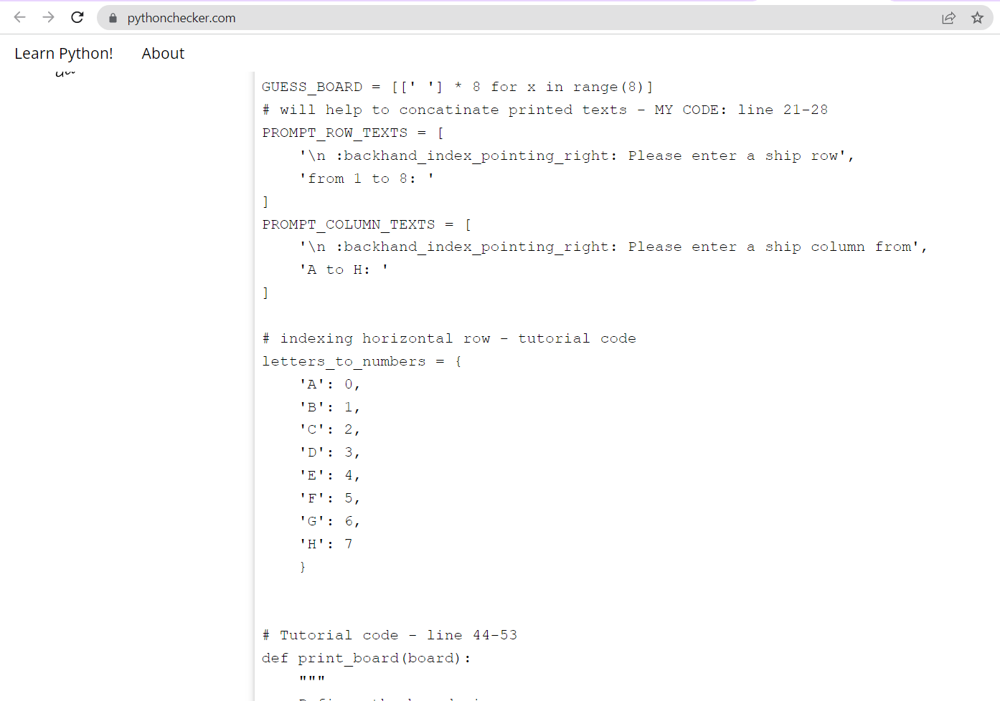

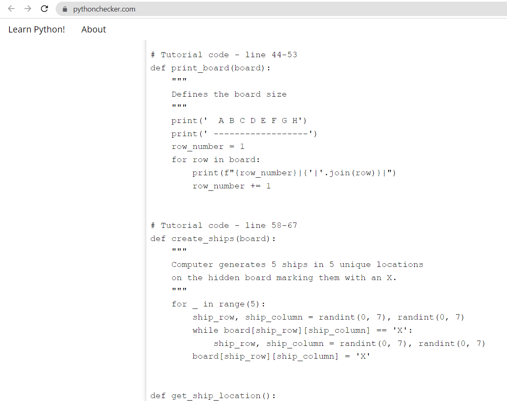

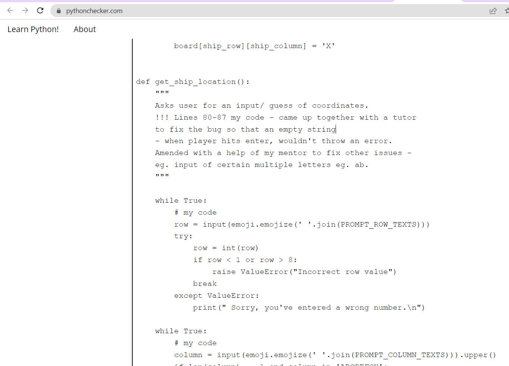

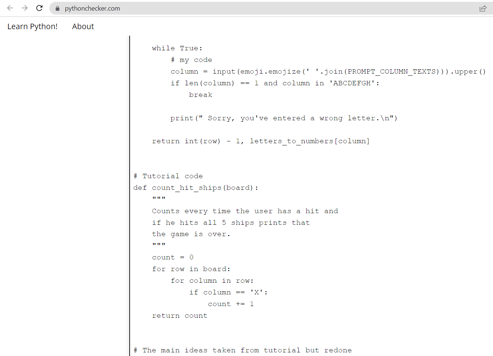

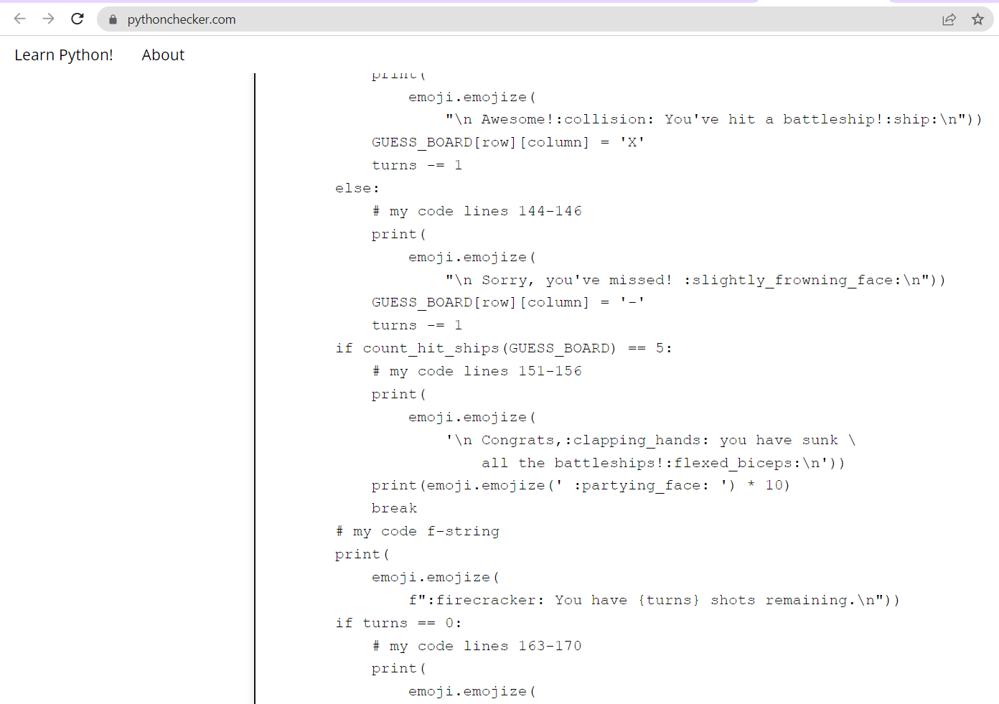

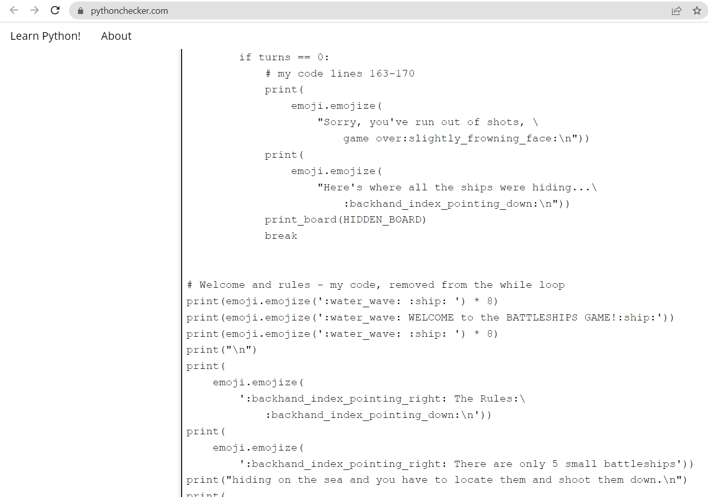

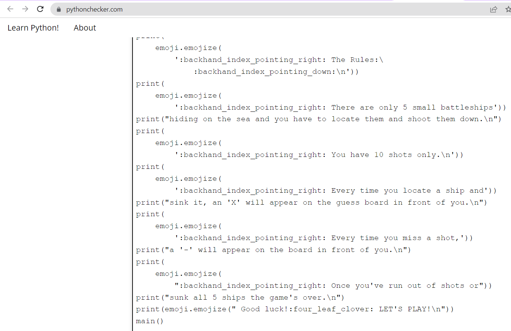

-----

## Fixed Bugs

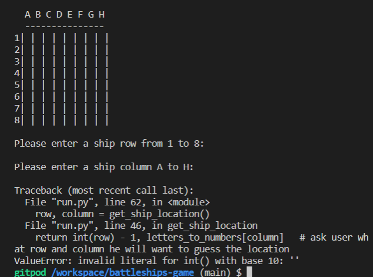

Originally, there was a bug when a user would press enter when asked for input (Enter number or letter.The program would throw an error when an empty string entered, this was fixed.

Also 

-----

## Deployment

### Deployment to Heroku

This site was deployed to Heroku pages by taking the following steps:
1. Log into your Heroku account
2. On your right hand side, click on the button ‘New’ and then click ‘create a new app’
3. Name your app and chose a region, then click ‘Create app’ button below
4. Click on the Settings in the tab
5. Click add Buildpack to add 2 buildpack as follows: first `heroku/python` and then `heroku/nodejs`, save changes
6. You must then create a Config var (click reveal Config Vars under the Settings, just above the Buildpack) called `PORT` (under key) and set it to `8000` (under value) and click add, then hide Config Vars
7. Click Deploy on the tab and chose deployment method: connect to your GitHub repository
8. Search for your repository, once found, connect.
9. Scroll down to Manual deploy and click ‘Deploy branch’. Your app will be built.
10. Once you ‘App was successfully deployed’ message and button with your deployed link, you can click on it to see your app.

### Forking the GitHub Repository

If you are interested how to fork this repository or how to make a local clone, this information can be found in Github documentation [here](https://docs.github.com/en/repositories/creating-and-managing-repositories/cloning-a-repository)

-----

